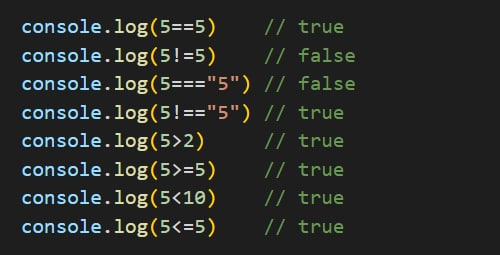
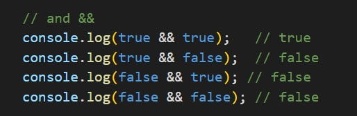
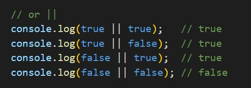
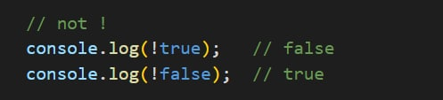
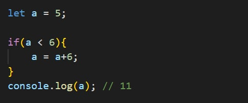
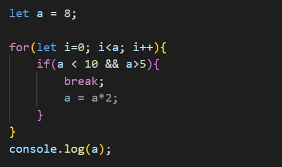
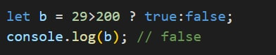

# Comparison operator

#
# Comparison logical operator
#
## Operator and / && 

#
## Operator or / ||

#
## Operator not / !

#
# if / else, Switch and Ternary operator
#
## Operator if()

#
## Operator if() ... else

#
## Operator if() ... else if()... else

#
## Switch

#
## Ternary
#### Условный (тернарный) оператор - единственный оператор в JavaScript, принимающий три операнда: условие, за которым следует знак вопроса (?), затем выражение, которое выполняется, если условие истинно, сопровождается двоеточием (:), и, наконец, выражение, которое выполняется, если условие ложно. Он часто используется в качестве укороченного варианта условного оператора if.
