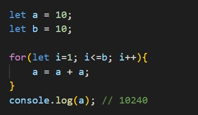
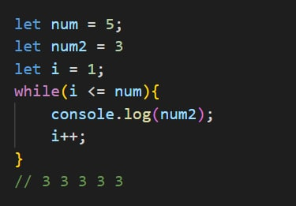
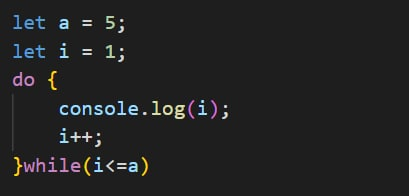
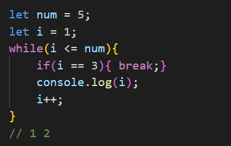
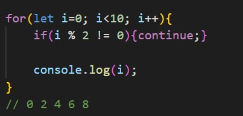

# Comparison operator

#
# Comparison logical operator
#
## Operator and / && 

#
## Operator or / ||

#
## Operator not / !

#
# if / else, Switch and Ternary operator
#
## Operator if()

#
## Operator if() ... else

#
## Operator if() ... else if()... else

#
## Switch

#
## Ternary

#
# For loop (break/continue) and While loop
## for loop

#
## while loop

#
## do while loop

#
## break and continue

